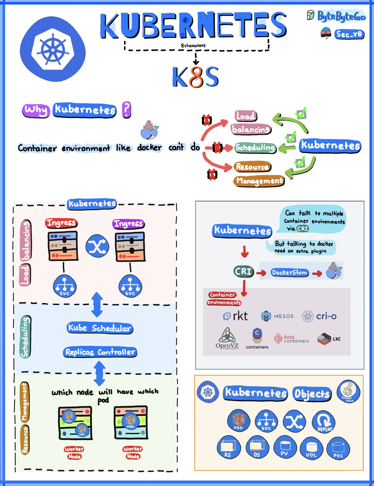

# Kubernetes Deep Dive


## Bigdata Stack Build on K8S


## Table of contents
- [Requirements](#requirements)
- [Usage](#usage)
- [Contributing](#contributing)
- [Contact](#Contact)
- [License](#license)
## Overview k8s


### Docker Publish
1. Jupyterhub
```
docker pull ghcr.io/tuancamtbtx/jupyterhub:main
```
2. Airflow
```
docker pull ghcr.io/tuancamtbtx/airflow:main
```
3. Spark
```
docker pull ghcr.io/tuancamtbtx/spark:main
```
4. Flink
```
docker pull ghcr.io/tuancamtbtx/flink:main
```
5. Superset
```
docker pull ghcr.io/tuancamtbtx/superset:main
```
## Contributing
The project has a separate contribution file. Please adhere to the steps listed in the separate contributions [file](./CONTRIBUTING.md)

## Contact
You can reach me on 
<div>
  <a href="https://t.me/Tuancamtbtx" target="_blank"></a>
  <a href = "mailto:nguyenvantuan140397@gmail.com"></a>
  <a href="https://www.linkedin.com/in/tuanbacam" target="_blank"></a>
</div>

## License
[](./LICENSE)

## Reference:
Overview of Kubernetes [alexxubyte](https://www.linkedin.com/in/alexxubyte)

