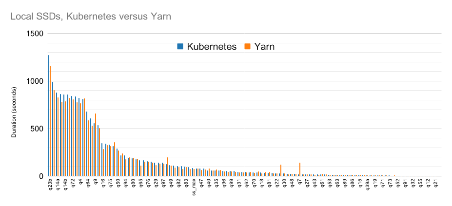
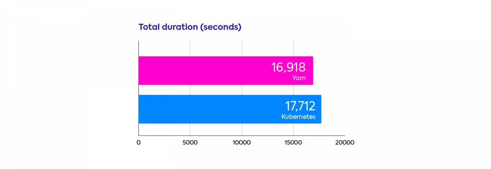
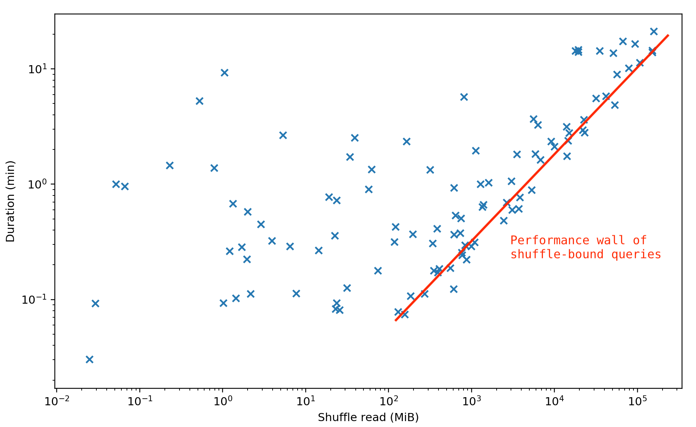

<h1 style="color:green">Apache Spark Performance Benchmarks show Kubernetes has caught up with YARN</h1>

## The Pros and Cons apache Spark run On the k8s
1.1 Core Concepts

1.2 How to submit a Spark App
- Using `spark-submit` to execute app to spark cluster deployed on the k8s
- Using spark operator or k8s manifest with customed docker

1.3 Pros and Cons:

| Pros of Deploying Spark on Kubernetes | Cons of Deploying Spark on Kubernetes |
| --- | --- |
| Efficient Resource Utilization: Kubernetes allows for efficient resource management and allocation, providing flexibility in scaling Spark resources based on demand. | Complexity: Setting up and managing Spark on Kubernetes can be complex, requiring expertise in both Spark and Kubernetes, potentially leading to a steep learning curve for the team. |
| Scalability: Kubernetes enables seamless scaling of Spark clusters, allowing them to dynamically adjust to varying workloads. | Performance Overhead: Running Spark on Kubernetes may introduce additional performance overhead due to the abstraction layer provided by Kubernetes, compared to running directly on dedicated infrastructure. |
| Resource Isolation: Kubernetes provides strong isolation between Spark applications, ensuring that they do not impact each other's performance. | Networking Challenges: Networking in Kubernetes can be challenging, especially for data-intensive workloads like Spark, leading to potential bottlenecks and performance issues. |
| Infrastructure Flexibility: Kubernetes abstracts the underlying infrastructure, allowing Spark to run on diverse environments, including on-premises and cloud-based clusters. | Operational Complexity: Managing the lifecycle of Spark applications on Kubernetes, including monitoring, logging, and troubleshooting, can introduce operational complexities. |
| Resource Efficiency: Kubernetes can optimize resource utilization by packing multiple Spark applications onto the same cluster, reducing idle resources. | Learning Curve: Teams may need to invest time and effort in understanding Kubernetes concepts and best practices to effectively manage Spark deployments. |

## Benchmarks
### Setup

### Spark on Kubernetes has caught up with Yarn

Aggregated results confirm this trend. The total durations to run the benchmark using the two schedulers are very close to each other, with a 4.5% advantage for YARN.

## How to optimize shuffle with Spark on Kubernetes
Most long queries of the TPC-DS benchmark are shuffle-heavy. The plot below shows the durations of TPC-DS queries on Kubernetes as a function of the volume of shuffled data. When the amount of shuffled data is high (to the right), shuffle becomes the dominant factor in queries duration. In this zone, there is a clear correlation between shuffle and performance.

